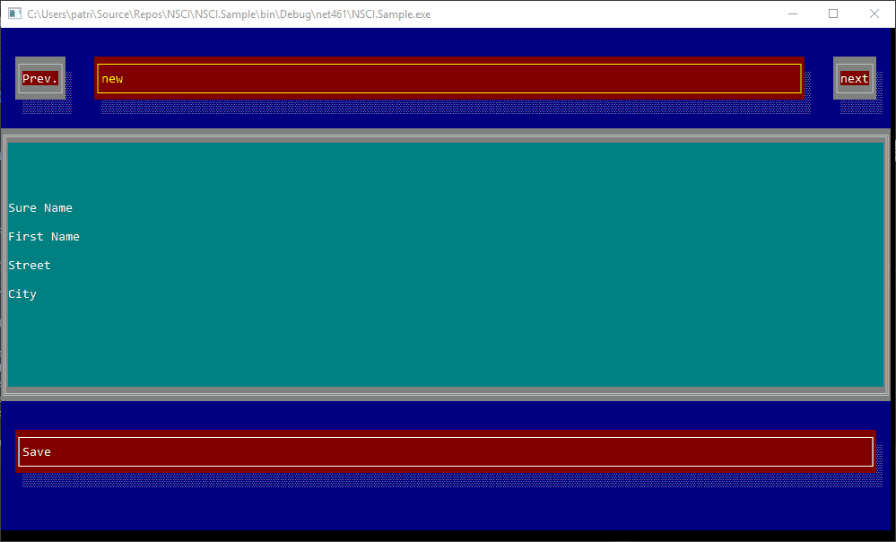

# NSCI
NSCI (Net Standard Console Interface) is an window system for .NetStandard console applications.
It aim's to provide a platform-agnostic graphical user interface .NetStandard (as long as the platform supports a console).

Inspired by WPF It uses similar mechanics. It has its own kind of dependency propertys ([NDPropertys](https://github.com/LokiMidgard/NDProperty)) will support styling and binding. Hopefully threre will be a generator that transforms xaml like xml declarations to code.

It started as a fork of [CLRCLI](https://github.com/PhonicUK/CLRCLI). But no longer shares code with this framework besids some class names like ```RootWindow```.



## Getting Started

**This Project is still in an early stage!** _So don't expect it supports every feature that is needed._

Your starting point is the RootWindow. You only have one instance per 
application. The RootWindow can have one and only one child element. You can use Controls like Grid or Stackpanel to add multiple elements to the window. Just like you would do in WPF.

Once the RootWindow has been created, you need to call the ```Run()``` method on it. After this the render loop is started. There is no problem in changing the window size, but you may not use any members of the ```Console``` class that change color courser position oder print characters to the output. This can lead to a corrupted screen.


```RootWindow.Detach()``` will stop the render loop and clears the console window.

See the TestHarness app for a short 'Hello World' example.

## Supported Controls

It is planed to support following controls:

- [x] Root Window
- [ ] Dialog (no real new window but rendered in the console)
- [x] Button
- [x] TextBox
- [x] Label
- [x] Checkbox
- [ ] Slider
- [x] Listbox (*SingelSelctionItemsControl*)
- [x] Scrollview 
- [ ] Horizontal and vertical lines
- [x] Borders
- [ ] Progress bar
- [ ] Spinners
- [x] Grid
- [x] StackPanel


And following features:

- [x] Templates
- [x] Binding
- [ ] Styles
- [ ] XML based markup language like XAML


### Most likly not supported controls
Because this will be a pure c# implementation that should run not only on Windows, we can't use P/Invoke to call Methods on the console that are not available in the Managed console wraper provided by .Net. This means some functunality can't be provided by this project.
- Image
- Multiple Windows
- Mouse controle

## Limitations

- *The damned last character*  
  I haven't found a reliable way yet to set the last character (bottom right corner) without getting a line
  break that delets the first row of the buffer. For now this character will not be used.

